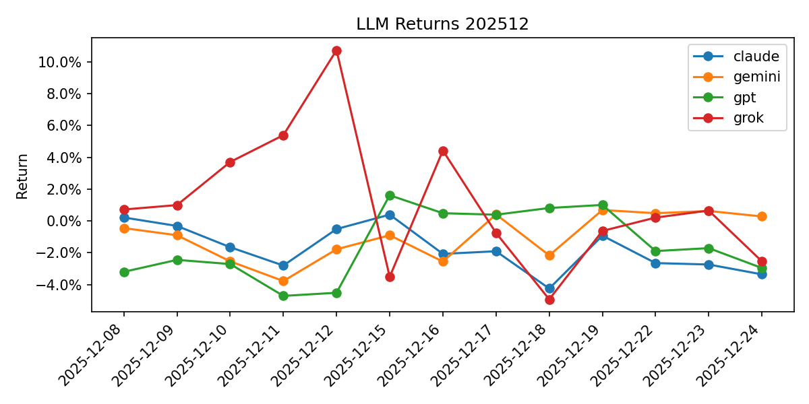

# Summary 202512

## Models

| LLM | Model |
| --- | --- |
| claude | claude-sonnet-4-5-20250929 |
| gemini | gemini-3-pro-preview |
| gpt | gpt-5.1 |
| grok | grok-4-1-fast-reasoning |

| Date | claude | gemini | gpt | grok |
| --- | --- | --- | --- | --- |
| 2025-12-08 | 0.22% | -0.45% | -3.20% | 0.72% |
| 2025-12-09 | -0.32% | -0.90% | -2.44% | 1.00% |
| 2025-12-10 | -1.65% | -2.54% | -2.71% | 3.70% |
| 2025-12-11 | -2.80% | -3.78% | -4.71% | 5.38% |
| 2025-12-12 * | -0.51% | -1.78% | -4.51% | 10.72% |
| 2025-12-15 | 0.40% | -0.90% | 1.61% | -3.51% |
| 2025-12-16 | -2.07% | -2.55% | 0.48% | 4.42% |
| 2025-12-17 | -1.90% | 0.41% | 0.39% | -0.76% |
| 2025-12-18 | -4.24% | -2.16% | 0.81% | -4.92% |
| 2025-12-19 * | -0.93% | 0.69% | 1.00% | -0.63% |
| 2025-12-22 | -2.65% | 0.48% | -1.89% | 0.21% |

## Holdings (week start → end)

| Week | Model | Symbol | Reason |
| --- | --- | --- | --- |
| 2025-12-07→2025-12-12 | claude | 8316.T (SUMITOMO MITSUI FINANCIAL GROUP) | 構造的なテーマ追い風（半導体/AI） |
| 2025-12-07→2025-12-12 | claude | 6758.T (SONY GROUP CORPORATION) | EPS 成長とROEが同業比優位 |
| 2025-12-07→2025-12-12 | gemini | 2802.T (AJINOMOTO CO INC) | 配当利回りが市場平均を上回る |
| 2025-12-07→2025-12-12 | gemini | 6098.T (RECRUIT HOLDINGS CO LTD) | 構造的なテーマ追い風（半導体/AI） |
| 2025-12-07→2025-12-12 | gpt | 4502.T (TAKEDA PHARMACEUTICAL CO LTD) | 構造的なテーマ追い風（半導体/AI） |
| 2025-12-07→2025-12-12 | gpt | 8267.T (AEON CO LTD) | 配当利回りが市場平均を上回る |
| 2025-12-07→2025-12-12 | grok | 6861.T (KEYENCE CORP) | EPS 成長とROEが同業比優位 |
| 2025-12-07→2025-12-12 | grok | 6752.T (PANASONIC HOLDINGS CORP) | 構造的なテーマ追い風（半導体/AI） |
| 2025-12-15→2025-12-19 | claude | 8306.T (MITSUBISHI UFJ FINANCIAL GROUP) | 日銀の利上げ観測により利ざや改善期待が高まる中、12月初旬に上場来高値を更新。金融政策の正常化と株主還元強化により年末ラリーでの上昇が期待される |
| 2025-12-15→2025-12-19 | claude | 9984.T (SOFTBANK GROUP CORP) | AI半導体設計のAmpere買収(約9730億円)により、OpenAI投資に続きAI関連事業を強化。アナリストコンセンサスは「買い」で目標株価まで31%の上昇余地 |
| 2025-12-15→2025-12-19 | gemini | 5713.T (SUMITOMO METAL MINING CO) | 中国の追加景気刺激策への期待から銅価格が最高値を更新しており、金曜日に8.95%急騰したモメンタムが週明けも継続すると予想。 |
| 2025-12-15→2025-12-19 | gemini | 9984.T (SOFTBANK GROUP CORP) | 米国株の史上最高値更新に加え、米データセンター運営会社Switchの買収検討報道がAI投資の加速として好感され、上昇が期待できる。 |
| 2025-12-15→2025-12-19 | gpt | 7203.T (TOYOTA MOTOR CORP) | 年初来高値圏ながら、直近1週間で日経平均をアウトパフォームしつつもPERは約10倍台前半と依然割安水準。米国でのハイブリッド増産投資や好調な販売に支えられた増収基調が続いており、短期的にも強いモメンタムが継続しやすいと判断。週初の押し目があれば自動車セクターの物色継続で一段高を狙える局面。 |
| 2025-12-15→2025-12-19 | gpt | 6758.T (SONY GROUP CORPORATION) | ゲーム・音楽・イメージセンサーなど成長事業が牽引し営業利益が2桁増益と堅調。足元1カ月は調整しているが、1年リターンは＋20％超と中期上昇トレンドを維持しており、年初来高値からの調整一服後のリバウンド余地が大きい水準。年末に向けたゲーム・エンタメ関連の需給改善も追い風となり、短期リバウンド狙いで妙味が高いと判断。 |
| 2025-12-15→2025-12-19 | grok | 4570.T (IMMUNO-BIOLOGICAL LABORATORIES) | X投稿で急騰継続が複数指摘されモメンタム強く高リターン期待 |
| 2025-12-15→2025-12-19 | grok | 9984.T (SOFTBANK GROUP CORP) | 先週12%上昇しソフトバンクグループの勢い継続、市場高値圏で有望 |
| 2025-12-22→2025-12-26 | claude | 9984.T (SOFTBANK GROUP CORP) | AI投資の拡大とOpenAIへの大型投資による収益増、年末相場での個人投資家の注目度の高さ、12月20日の週足で6.1%上昇と強い勢い |
| 2025-12-22→2025-12-26 | claude | 7011.T (MITSUBISHI HEAVY INDUSTRIES) | 防衛費増額政策の追い風、アナリストの平均目標株価4,396円で15%超の上昇余地、日銀利上げ後の内需型バリュー株への資金シフト |
| 2025-12-22→2025-12-26 | gemini | 8306.T (MITSUBISHI UFJ FINANCIAL GROUP) | 12月19日の日銀による利上げ（0.75%）決定を受け、利ざや拡大による収益改善が期待されるため。 |
| 2025-12-22→2025-12-26 | gemini | 8035.T (TOKYO ELECTRON) | 前週末の米国市場でマイクロン等の半導体株が急伸した流れを引き継ぎ、買い優勢が見込まれるため。 |
| 2025-12-22→2025-12-26 | gpt | 8306.T (MITSUBISHI UFJ FINANCIAL GROUP) | 日銀の追加利上げ観測で長期金利が上昇基調にあり、国内大手銀行株は利ざや拡大期待から物色が継続しやすい環境。MUFGはインド・シュリラムファイナンスへの大型出資など成長投資と自社株買いを併用しており、利益成長・株主還元ともに好調で、短期的にも金融セクターへの資金流入の恩恵を受けやすいと判断。 |
| 2025-12-22→2025-12-26 | gpt | 9984.T (SOFTBANK GROUP CORP) | OpenAIやAIインフラ関連への大型投資が続き、中長期のAIテーマの中核銘柄として売買代金・信用残ともに高水準で短期資金が集中しやすい状態。直近は調整後に大陽線で急反発しており、出来高を伴うリバウンド局面でモメンタムの継続が期待でき、ボラティリティの高い値動きを週次ゲームのリターン最大化に活用しやすい。 |
| 2025-12-22→2025-12-26 | grok | 2315.T (CAICA DIGITAL INC) | 今期経常41%上方修正で短期上昇期待 |
| 2025-12-22→2025-12-26 | grok | 4570.T (IMMUNO-BIOLOGICAL LABORATORIES) | 複数投稿で急騰期待が高くモメンタム強い |