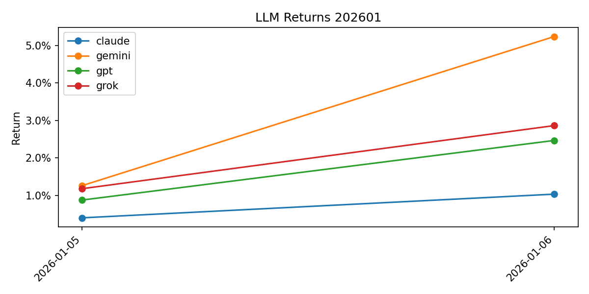

# Summary 202601

## Models

| LLM | Model |
| --- | --- |
| claude | claude-sonnet-4-5-20250929 |
| gemini | gemini-3-pro-preview |
| gpt | gpt-5.1 |
| grok | grok-4-1-fast-reasoning |

| Date | claude | gemini | gpt | grok |
| --- | --- | --- | --- | --- |
| 2026-01-05 | 0.40% | 1.26% | 0.87% | 1.18% |
| 2026-01-06 | 1.03% | 5.24% | 2.47% | 2.86% |

## Holdings (week start → end)

| Week | Model | Symbol | Reason |
| --- | --- | --- | --- |
| 2026-01-05→2026-01-09 | claude | 8316.T (SUMITOMO MITSUI FINANCIAL GROUP) | 日銀の追加利上げ継続見通しで金利上昇環境が銀行株に追い風。2026年3月期は大幅増益を達成し、配当増配も期待される。アナリストも買い推奨。 |
| 2026-01-05→2026-01-09 | claude | 6976.T (TAIYO YUDEN CO LTD) | AIサーバー向けコンデンサ需要の拡大で業績好調。2026年3月期Q2は増収増益で通期予想も上方修正。AI・半導体テーマの中核銘柄。 |
| 2026-01-05→2026-01-09 | gemini | 8473.T (SBI HOLDINGS INC) | 2026年4月施行予定の暗号資産税制改正（申告分離課税・税率20%化）による市場活性化期待と、金利上昇による金融事業の収益改善。 |
| 2026-01-05→2026-01-09 | gemini | 8306.T (MITSUBISHI UFJ FINANCIAL GROUP) | 政策金利0.75%への引き上げを受けた利ざや拡大期待に加え、実質賃金上昇とデフレ脱却による国内資金需要の回復が追い風。 |
| 2026-01-05→2026-01-09 | gpt | 9984.T (SOFTBANK GROUP CORP) | OpenAIへの巨額追加出資でAIエコシステムの中核ポジションを強化しており、短期的にはAI関連材料への物色と信用買い残の増加でボラティリティを伴う上昇余地が大きい週と判断。年初来で急騰後いったん調整しており、直近1週間は再び上向きに転じている点からも、年明けのテーマ再燃によるリバウンド狙いがしやすい。 |
| 2026-01-05→2026-01-09 | gpt | 7203.T (TOYOTA MOTOR CORP) | 世界販売が堅調で収益性も高水準を維持する一方、PERとPBRは依然割高感が限定的で、TOPIX主力として年初の資金流入を受けやすいディフェンシブ成長株。直近1か月で上昇トレンドを維持しつつ年初来高値圏から小幅調整しており、年明けに自動車・日本株インデックスへの買い戻しが入ることで、1週間ベースでも安定したプラスリターンを狙いやすいと判断。 |
| 2026-01-05→2026-01-09 | grok | 8035.T (TOKYO ELECTRON) | 米半導体装置株（LRCX+8.11%、ASML+8.78%）急騰を受け、東京エレクトロンが連動上昇期待。2026年日本株強気展望 |
| 2026-01-05→2026-01-09 | grok | 285A.T (KIOXIA HOLDINGS CORPORATION) | 米メモリ株（SNDK+15.95%、MU+10.50%）急騰でキオクシアに爆上げ期待。X投稿で注目株として複数挙がる |