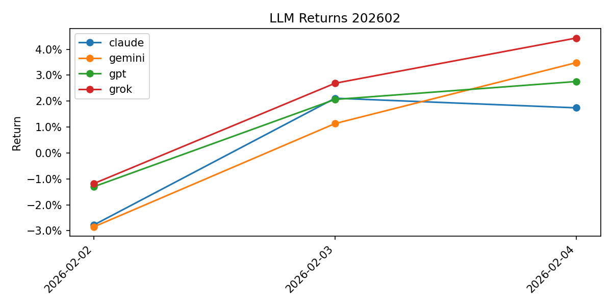

# Summary 202602

## Models

| LLM | Model |
| --- | --- |
| claude | claude-sonnet-4-5-20250929 |
| gemini | gemini-3-pro-preview |
| gpt | gpt-5.1 |
| grok | grok-4-1-fast-reasoning |

| Date | claude | gemini | gpt | grok |
| --- | --- | --- | --- | --- |
| 2026-02-02 | -2.78% | -2.85% | -1.30% | -1.18% |
| 2026-02-03 | 2.11% | 1.13% | 2.06% | 2.69% |
| 2026-02-04 | 1.74% | 3.48% | 2.75% | 4.43% |

## Holdings (week start → end)

| Week | Model | Symbol | Reason |
| --- | --- | --- | --- |
| 2026-02-02→2026-02-06 | claude | 8316.T (SUMITOMO MITSUI FINANCIAL GROUP) | 銀行株が2026年注目セクターとして専門家に選ばれており、実質賃金上昇と日銀利上げが追い風。1月決算で4-12月純利益が前年比23%増の最高益を記録し、2月上旬の決算発表を控えモメンタム期待 |
| 2026-02-02→2026-02-06 | claude | 9984.T (SOFTBANK GROUP CORP) | OpenAIへの最大300億ドル追加投資が報道され、2月12日決算発表を控えAI投資への期待が高まる。保有するArmもAIチップ需要で好調であり、AI関連銘柄として2026年最重要テーマに位置付けられている |
| 2026-02-02→2026-02-06 | gemini | 8306.T (MITSUBISHI UFJ FINANCIAL GROUP) | 2月2日に算出が開始される「日経銀行株トップ10指数」構成銘柄への資金流入期待と、国内金利上昇による利ざや改善というファンダメンタルズの好転。 |
| 2026-02-02→2026-02-06 | gemini | 7011.T (MITSUBISHI HEAVY INDUSTRIES) | 2月8日の衆院選投開票を控え、高市首相が掲げる防衛力強化や原発活用などの国策（高市トレード）の筆頭銘柄として、選挙週に物色が強まると予想。 |
| 2026-02-02→2026-02-06 | gpt | 7203.T (TOYOTA MOTOR CORP) | トヨタは決算シーズンでの好決算期待と円安基調が自動車輸出企業の業績押し上げ要因となっており、短期的にも業績モメンタムと需給の両面で株価上昇余地があると判断。 |
| 2026-02-02→2026-02-06 | gpt | 9984.T (SOFTBANK GROUP CORP) | ソフトバンクグループは米ハイテク株の動向やARM関連材料に連動しやすく、ボラティリティの高い銘柄であるため、1週間のリターン最大化ゲームにおいてイベント・ニュースによる短期上昇を狙いやすいと判断。 |
| 2026-02-02→2026-02-06 | grok | 7011.T (MITSUBISHI HEAVY INDUSTRIES) | 衆院選自民党優勢で防衛関連株に買い。高市トレードのテーマ継続期待。 |
| 2026-02-02→2026-02-06 | grok | 4186.T (TOKYO OHKA KOGYO CO) | 半導体薬品大手、直近値上がり率上位でモメンタム強く、AI需要で上昇継続。 |